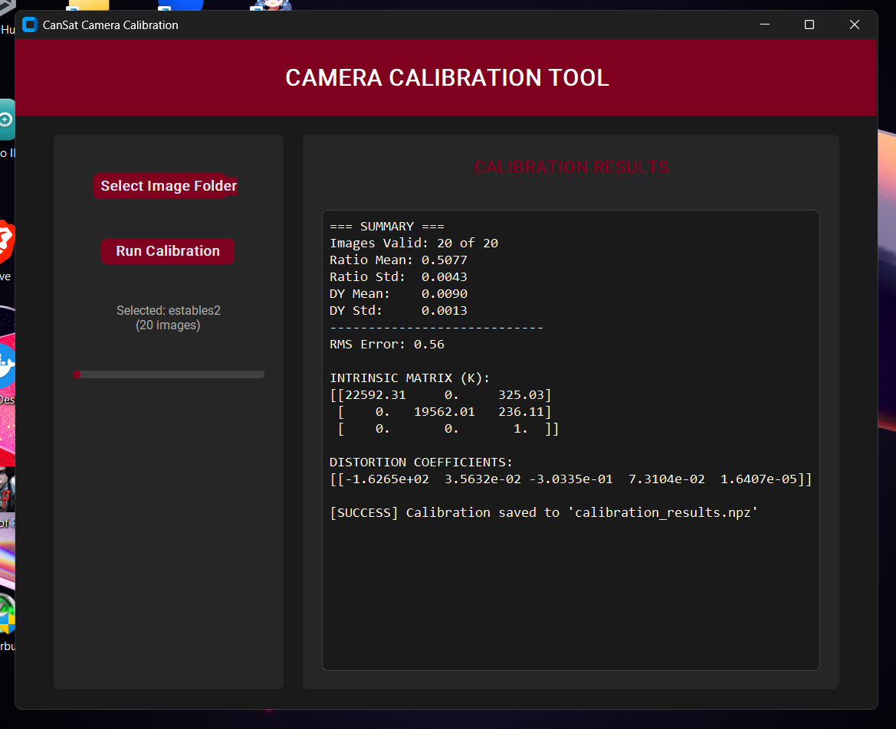

# CanSat Camera Calibration Tool



Este proyecto es una herramienta de interfaz grafica diseñada para la calibracion de camaras utilizadas en proyectos CanSat. Permite procesar un conjunto de imagenes de un patron de calibracion para obtener los parametros intrinsecos y los coeficientes de distorsion de la lente.

## Funcionalidades

- Seleccion de carpetas con imagenes en formato .jpg.
- Deteccion automatica de puntos de interes mediante procesamiento de imagenes y clustering (K-Means).
- Calculo del error RMS de la calibracion.
- Generacion de la Matriz Intrinseca (K) y Coeficientes de Distorsion.
- Guardado automatico de resultados en un archivo `calibration_results.npz`.


## Instalacion

Primero crear un entorno virtual
- python -m venv nombre_entorno
Procedemos a activar el entorno
- .\env\Scripts\activate (en windows)
- source env/bin/activate (en Linux)

una vez creado y activado el entorno, para instalar las dependencias necesarias, ejecuta el siguiente comando en tu terminal:

```bash
pip install -r requirements.txt
```

## Ejecucion

Una vez instaladas las dependencias, puedes iniciar la aplicacion ejecutando el archivo principal:

```bash
python calibration_app.py
```

## Instrucciones de Uso

1. Prepara una carpeta con las fotografias del patron de calibracion (preferiblemente en formato .jpg).
2. Abre la aplicacion y presiona el boton "Select Image Folder" para elegir dicha carpeta.
3. Presiona "Run Calibration" para iniciar el proceso.
4. Al finalizar, los resultados se mostraran en el panel derecho y se generara el archivo `calibration_results.npz` en el directorio raiz.

## Detalles Tecnicos

La aplicacion utiliza un patron de 6 filas y 9 columnas con medidas especificas (en caso de utilizar un ejemplo distinto habra que cambiar estos parametros):
- Espaciado: 11.5 mm
- Distancia Horizontal: 23.5 mm
- Distancia Vertical: 26.5 mm

El procesamiento interno utiliza OpenCV para la calibracion y scikit-learn para la organizacion de los puntos detectados.